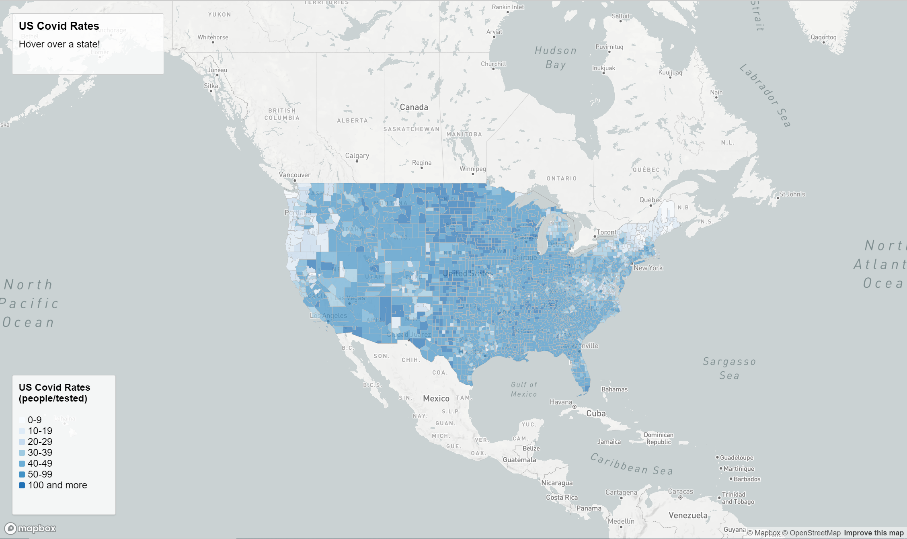

# Covid-Thematic-Maps

In this lab I design web map application for COVID cases and rates in 2020. The first map is a choropleth map with the rates of covid in the country per county and the second map is a proportional map for covid cases around the country.

The data that was needed to complete this map came from the [2018 ACS 5 year estimates](https://data.census.gov/cedsci/table?g=0100000US.050000&d=ACS%205-Year%20Estimates%20Data%20Profiles&tid=ACSDP5Y2018.DP05&hidePreview=true) while the county boudary shapefile came from the [U.S. Census Bureau](https://www.census.gov/geographies/mapping-files/time-series/geo/carto-boundary-file.html).

The primary function of this map is to see the covid rates in your area by hovering over an area and it will tell you the rates in those areas.

COVID CASES

